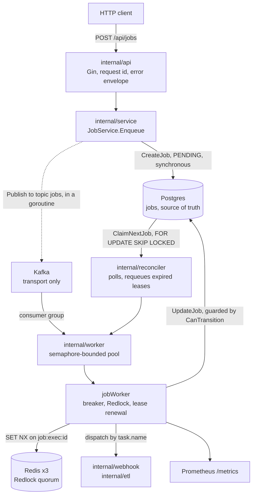

# Conduit

[](https://github.com/JustinK33/Conduit/actions/workflows/ci.yml) [](https://github.com/JustinK33/Conduit/actions/workflows/cd.yml)

A job queue and small ELT runtime in Go where Postgres is the source of truth and Kafka is only transport.

## What it does

You POST a job, Conduit runs it, and it keeps running it across process crashes, broker restarts, and handler failures without anyone watching.
Two handlers ship with it: `webhook` for outbound HTTP delivery and `sql.etl` for Postgres-to-Postgres pipelines defined in JSON.

The design decision everything else follows from is that Kafka holds no authority.
A job is durable the moment the Postgres insert commits, and the Kafka publish happens afterwards in a goroutine, so the HTTP response doesn't wait on a broker round trip.
That would normally be a data-loss bug, since a dropped publish means nothing ever consumes the job.
It isn't one here, because the reconciler polls Postgres directly with `FOR UPDATE SKIP LOCKED` and feeds the same worker pool.
Kafka is the fast path and the database is the floor.

Crash recovery works the same way rather than being a separate mechanism.
A worker that claims a job takes a lease with an expiry and renews it while running, so a process that dies mid-job leaves a `RUNNING` row with a stale `lease_expires_at`.
`RequeueExpiredRunning` finds those and moves them back to `PENDING` with `last_error` set to say why.
Nothing has to notice the crash.
Every state change goes through `CanTransition`, so `COMPLETED` and `DEAD` are terminal in the store and not just by convention in the caller.

It is not a workflow orchestrator. There are no DAGs, no fan-out, no dependencies between jobs, and no UI.

## Tech stack

| Layer | What it uses |
| --- | --- |
| Language | Go 1.23 |
| HTTP | Gin, with request-id, structured-logging, metrics, and panic-recovery middleware |
| State | PostgreSQL via `pgx/v5`, pool tuned and exposed as env vars |
| Transport | Kafka via IBM `sarama`, snappy compression, 5 ms flush |
| Locking | Redis via `go-redis/v9`, 3-node Redlock quorum |
| Logs | `zerolog` |
| Metrics | `prometheus/client_golang`, scraped by Prometheus, Grafana alongside |
| Deploy | Docker Compose for local, Kubernetes manifests under `deploy/k8s` with an HPA |
| Checks | `go vet`, `go test -race`, five benchmark suites, k6 load test in CI |

Six direct requires.

## Architecture



An enqueue writes the job to Postgres as `PENDING` and returns; the publish to Kafka is fire-and-forget behind it.
A consumer hands the message to the worker pool, which is bounded by a semaphore and a buffered channel, and `jobWorker` does the four things that have to happen in order: ask the circuit breaker, take the Redlock so two instances consuming the same topic can't run one job twice, execute the registered handler under `Task.Timeout`, then write the result back through the state machine.
A retryable failure computes a backoff delay, sets `scheduled_at` into the future, walks the job `RUNNING -> FAILED -> PENDING`, and republishes it; an unknown task name returns `ErrNoRetry` and goes straight to `DEAD` rather than looping.
The reconciler runs on its own ticker doing the two jobs Kafka can't: pulling `PENDING` work the broker never delivered, and rescuing `RUNNING` rows whose lease ran out.

[docs/ARCHITECTURE.md](docs/ARCHITECTURE.md) has the full diagram, the state machine, and a per-package breakdown.

## What building this taught me

**A retry engine nobody calls still passes its unit tests.** `internal/retry` computed exponential backoff correctly and had tests to prove it, and the worker never applied the result. Jobs entered `FAILED` and stopped there permanently. In the same pass I found `Attempt` was never incremented, the `PENDING -> RUNNING` transition wasn't happening at all, and `Task.Timeout` was parsed but never turned into a `context.WithTimeout`, so a hung handler hung forever. Every one of those is a component that worked in isolation and was not wired to anything. Testing the retry engine was never the same thing as testing that jobs retry.

**Adding jitter to a capped backoff uncaps it.** The engine clamped the delay to `MaxDelay` and then added a random jitter on top, which is the natural order to write and puts the result above the cap. It needs clamping again after the jitter. A backoff ceiling that the jitter can exceed is not a ceiling, and the test that would have caught it had to assert on the maximum over many runs rather than on one.

**Moving work off the hot path is worth measuring, and worth admitting the shortcut in.** The Kafka publish used to sit inline in `Enqueue`, so every HTTP request waited on a broker round trip: p50 2 to 3 ms, roughly 280 req/s. Firing it in a goroutine after the Postgres commit took p50 to 0.82 ms and sustained throughput to about 4,000 req/s, peaking at 11,256 with 200 concurrent clients. The honest version of that story is that `go func()` around a `SyncProducer` is not what you'd ship at scale. Sarama's `AsyncProducer` is the real answer and it requires draining an error channel in a background loop or you leak. I took the simpler one deliberately, and the reconciler is what makes it safe rather than lucky.

**A benchmark with no entry point can be broken for months.** Five `_bench_test.go` files existed and the Makefile had no target that ran them, so nothing did. When I added `make bench` it hung. `BenchmarkBreakerRecordSuccess` rebuilt the circuit breaker inside the loop behind `StopTimer`/`StartTimer`, which meant the measured time per iteration barely grew, so Go kept raising `b.N` looking for a stable measurement and never found one. `make bench` finishes in about 55 seconds now. Unrunnable code rots exactly as fast as unwritten code, and looks better on a file listing.

**`wg.Add` racing `wg.Wait` is invisible without `-race`.** `Pool.Stop` closed the jobs channel and waited, while the dispatcher goroutine was still calling `wg.Add(1)` per dispatch. Under normal `go test` it passed every time. The fix is to put the dispatcher itself in the WaitGroup so nothing can `Add` after `Wait` starts. This is the class of bug where "it works on my machine" and "it works" have no relationship to each other, and the race detector in CI is the only reason I know about it.

**CI waiting for something that already died will wait for the full six hours.** The load-test job polled for server readiness in an unbounded loop, so a container that crashed at startup produced a job that sat there until GitHub's default timeout killed it. It now waits on `docker compose --wait` for infrastructure health, caps the readiness poll at 90 seconds, checks the process is still alive between polls, and carries a 15 minute job timeout. Every wait in automation needs a deadline and a liveness check, not one or the other.

**Offset pagination is a scan you pay for later.** `GET /api/jobs` uses keyset pagination over `(created_at DESC, id DESC)` behind an opaque base64 cursor, rather than `LIMIT/OFFSET`. It costs a slightly awkward API and buys stability under concurrent inserts, where an offset query silently skips or repeats rows as the table shifts underneath the pages.

## Documentation

- [docs/ARCHITECTURE.md](docs/ARCHITECTURE.md) is the reference: system diagram, job state machine, package-by-package breakdown, and the reasoning behind the Postgres-over-Kafka split.
- [PROJECT.md](PROJECT.md) has the API surface with curl examples and response shapes, the config table, and the measured load numbers.
- [docs/FEATURES.md](docs/FEATURES.md) goes deep on four pieces: the async publish and its tradeoff, Redlock, the Kubernetes manifests, and the CI/CD pipeline.
- [docs/use-cases/sql-elt.md](docs/use-cases/sql-elt.md) walks a real pipeline config, with [examples/daily_revenue_pipeline.json](examples/daily_revenue_pipeline.json) as the input.
- [docs/IMPROVEMENT_PLAN.md](docs/IMPROVEMENT_PLAN.md) is the running list of known gaps.
- [migrations/](migrations/) is the schema, applied by Postgres on first boot.

## Quick start

```bash
cp .env.example .env
make up
```

That brings up the app, Postgres, Kafka, three Redis nodes, Prometheus, and Grafana, gated on health checks so the app doesn't start before its dependencies.

```bash
make enqueue url=https://example.com/webhook   # returns a job id
make status id=<that-id>
make list state=FAILED
make ready                                     # per-dependency readiness
```

`/live` always returns 200 and is what the Kubernetes liveness probe uses. `/ready` pings Postgres and the Redis quorum and returns 503 with per-dependency detail, which is what gates traffic.

`make enqueue-elt` runs the SQL pipeline example, and needs the demo tables from `migrations/002_create_elt_demo.sql`.

Tests, which is also what CI runs before it boots a live stack and drives it with k6:

```bash
make vet
make test
make test-race
make bench
```

Every Makefile target is commented inline, and `make down` wipes the volumes for a clean start.
